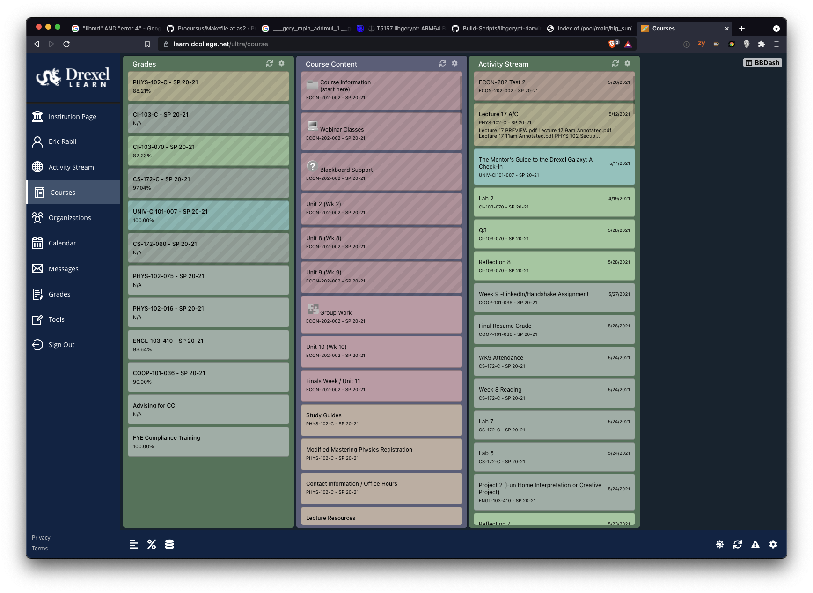
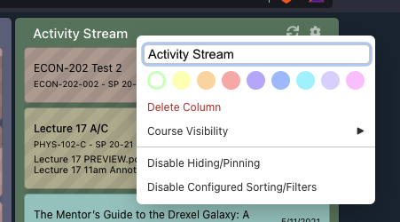
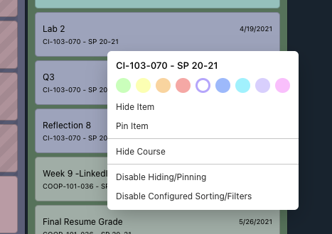

# BBDash
BBDash is an app that aims to aggregate commonly accessed data from Blackboard into a customizable dashboard.

Wanna chat? Hop into our [Discord](https://discord.gg/mf2UrHFvRb)!

## Features

- Contents Column, Activity Stream Column, Grades Column
- Pin items and courses, either per-column or globally
- Hide items and courses, either per-column or globally
- Sort columns by various item attributes in ascending or descending order
- Move columns around
- Rename columns
- Color coding for columns and courses
- Refreshing columns
- Content caching
- Discrete toggle in the top right of Blackboard

### Color Coding

Columns and items can be color coded by right-clicking them. A menu will be presented where you can change their color, or remove the color by selecting the active color.

[System Manual](MANUAL.md)

## Developing

### Prerequisites
Building BBDash requires [NodeJS](https://nodejs.org/en/download/) v14 or later, and [yarn v2](https://yarnpkg.com/)

### Setup
1. Clone the repo using `git clone https://github.com/EricRabil/BBDash.git`

2. In the base directory, execute `yarn` to install all dependencies for the project. We use [Yarn Workspaces](https://yarnpkg.com/features/workspaces) for managing our packages.

### Building
Once your environment is set up, you're ready to build.

All plain-TypeScript projects can be built in one go thanks to TS references. You can run `yarn ts:build` for a one-off build or `yarn ts:watch` for incremental builds.

To build the Chromium extension, run `yarn crx:build` or `yarn crx:watch` for incremental compilation.
